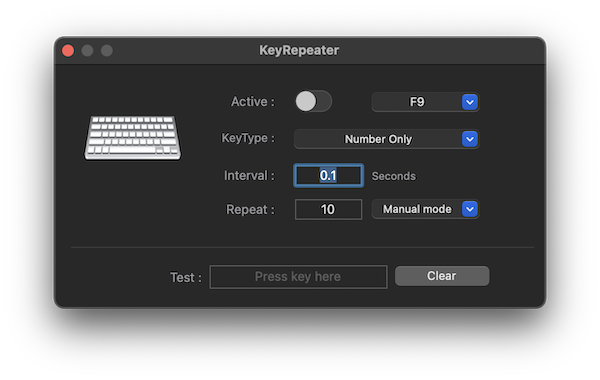
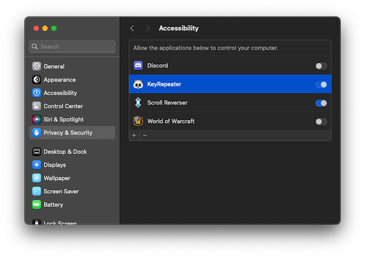

| 🐻 Screen[Recorder](/ScreenRecorder) | 🐯 Video[Player](/VideoPlayer) | 🐼 Key[Repeater](/KeyRepeater) | 🐥 Recorder[Agents](#) |
|:----------|:----------|:----------|:----------|

# Key Repeater
Have you played a game so hard that you broke your keyboard? Or do you have to press the keyboard repeatedly for 24 hours without sleeping? Let's find the solution.

## Setting modes
- Press the last key you pressed repeatedly the set number of times.
- If you press another key while a key is repeating, it will repeat the last key again.
- Manual mode: Repeat the key the set number of times.
- Infinite mode: Repeats the key indefinitely without stopping.
- Pushing mode: It repeats only when the key is pressed, and stops repeating when the key is released.

## Price Plans
| Category      | 🌱 Lite ver | 🌴 Pro ver |
|:--------------|:---------|:--------|
| Price         |  Free    | 9.9$    |
| Manual mode   |  [O]     | [O]     |
| Infinite mode |  [X]     | [O]     |
| Pushing mode  |  [X]     | [O]     |

## Support Enviroment
- Mac silicon, macOS 14.0 or higher
- Windows 11 and Windows 10 version 1809 or higher

## Installation
- Mac Silicon : [KeyRepeater-Lite-1.0.0.pkg](release/KeyRepeater-Lite-1.0.0.pkg)
- Windows : [KeyRepeater-Lite-1.0.0.msi](#)
- The Pro version can only be downloaded from the store.

## System Settings

## Privacy Policy
[Open Document](policy)

## Release History
- 2024-04-01 : 1.0.0

