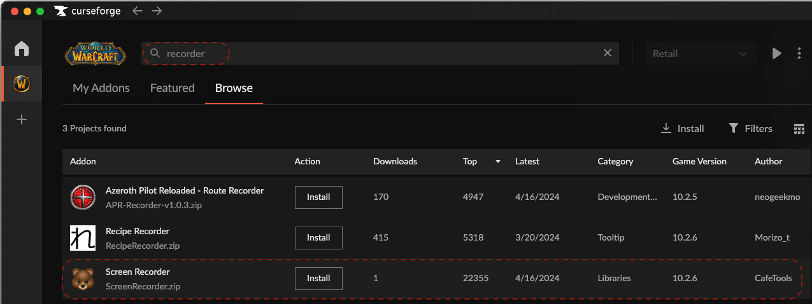

| 🐻 Screen[Recorder](/ScreenRecorder) | 🐯 Video[Player](/VideoPlayer) |
|:----------|:----------|

# Screen Recorder
In most desktop environments, recording the entire screen or a specific application is no longer difficult. Basically, there are functions provided by the operating system, and in some cases, commercial recording apps are used. However, my goal is to solve that problem because it is very tiring if I need to automatically record certain situations or record and stop repeatedly.

 

## Features
- Provides the functions of a typical screen recording application.
- Use with extra apps to automatically record specific game situations.
- Automatically start recording when the battlefield or arena starts in World of Warcraft
- Generates subtitles containing various information related to deaths and wins and losses during the game.

## Support World of Warcraft

- The only game currently supported by the product is World of Warcraft.
- ScreenRecorder's Download menu includes addon for World of Warcraft.
- Additionally, you can easily install addon from [CurseForge/ScreenRecorder](https://www.curseforge.com/wow/addons/screenrecorder).
 

 

- Check if it has been applied in the addon menu of World of Warcraft.
- After install the World of Warcraft addon, you must command /reload on the game.

## Support Enviroment
- Mac(apple), macOS 14.0 or higher
- Windows 10 higher

## Download & Installation (Desktop)
- macOS: [ScreenRecorder-Lite-1.0.5.pkg](release/ScreenRecorder-Lite-1.0.5.pkg)
- Windows: Service is being prepared.

## Future Plans
- World of warcraft
    - Currently only Arena and Battleground modes are supported.
    - I plan to support mythick & raid dungeon modes.

- League of Legends
    - It's being planned.

## System Settings

## How to use for automatic recording?
- Install World of Warcraft addon
- Just run ScreenRecorder Desktop before join battleground or arena.
- No need to press any buttons.

## Release History
- 2024-04-27 : 1.0.5
    - It has been modified to record Discord sound when recording World of Warcraft.
- 2024-04-26 : 1.0.4
    - Optimized to use minimal memory.
- 2024-04-22 : 1.0.3
    - The performance of the program has been optimized.
- 2024-04-01 : 1.0.0

## Privacy Policy
- [Open Document](policy)

