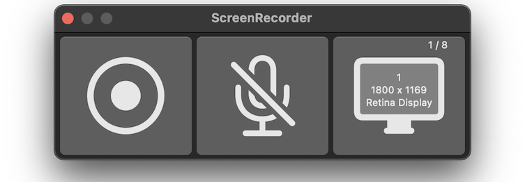
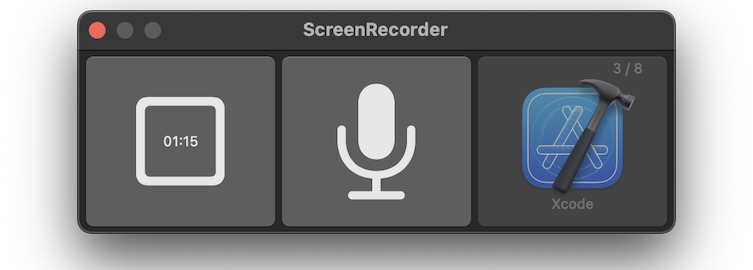
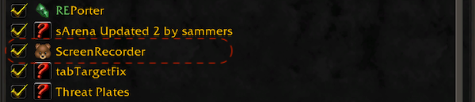
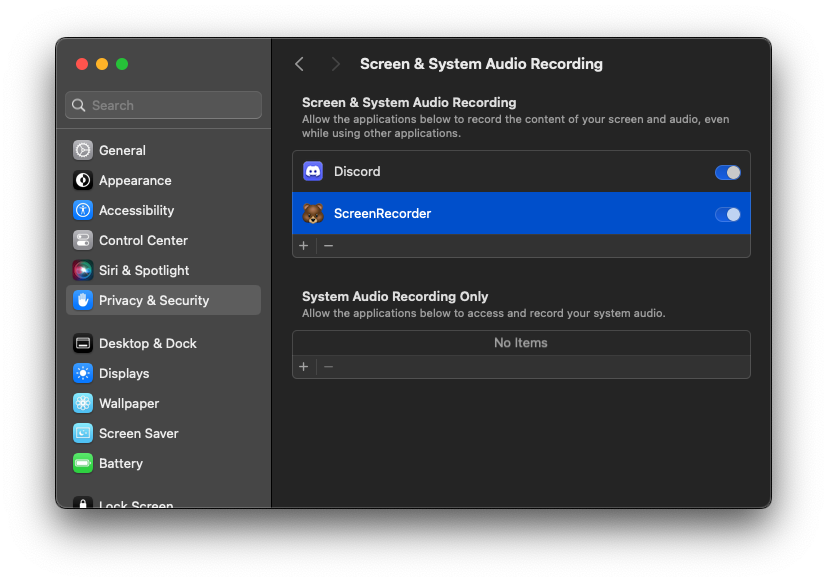

| [🏠](/) | 🐻 Screen[Recorder](/ScreenRecorder) | 🐯 Video[Player](/VideoPlayer) | 🐼 Key[Repeater](/KeyRepeater) | 🐥 Recorder[Agents](#) |
|:----------|:----------|:----------|:----------|:----------|

# Screen Recorder
In most desktop environments, recording the entire screen or a specific application is no longer difficult. Basically, there are functions provided by the operating system, and in some cases, commercial recording apps are used. However, my goal is to solve that problem because it is very tiring if I need to automatically record certain situations or record and stop repeatedly.

 

## Features
- Provides the functions of a typical screen recording application.
- Use with agent apps to automatically record specific game situations.
- Automatically start recording when the battlefield starts in World of Warcraft
- Any game can be supported as long as it develop a plug-in related to that game.
- Generates subtitles containing various information related to deaths and wins and losses during the game.

## About World of Warcraft

- The only game currently supported by the product is World of Warcraft.
- It is distributed together with agent app and add-ons for World of Warcraft Dragonflight.
- After installing the World of Warcraft addon, you must command /reload on the game.
- The addon is also distributed on [CurseForge](https://www.curseforge.com), so you can download the latest version here.

## Support Enviroment
- Mac silicon, macOS 14.0 or higher
- Windows 11 and Windows 10 version 1809 or higher

## Installation
- Screen Recorder
    - Mac Silicon : [ScreenRecorder1.0.0.pkg](#)
    - Windows : [ScreenRecorder1.0.0.msi](#)

- Support World of warcraft
    - Installation is possible from the Recorder menu.
    - Agent(wow log parser) + Wow Game Addon

- Support League of Legends
    - It's being planned.

## System Settings

## How to use for automatic recording?
- Just run Screen Recorder before play game.
- No need to press any buttons.

## Privacy Policy
[Open Document](policy)

## Release History
- 2024-04-01 : 1.0.0

