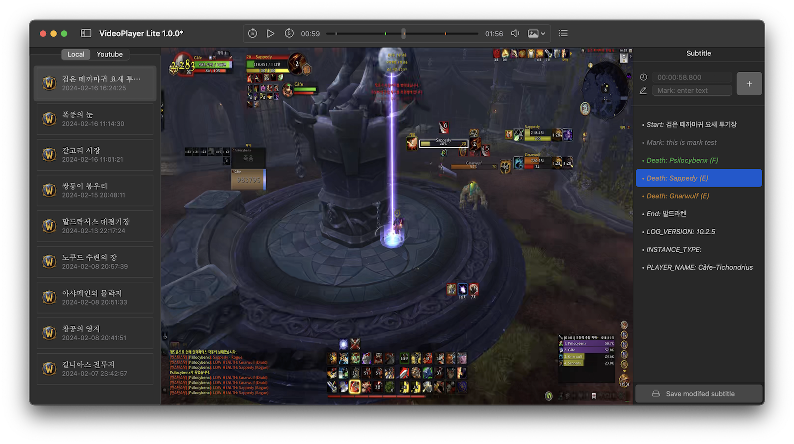

| 🐻 Screen[Recorder](/ScreenRecorder) | 🐯 Video[Player](/VideoPlayer) | 🐼 Key[Repeater](/KeyRepeater) | 🐥 ProxyApps |
|:----------|:----------|:----------|:----------|

# Video Player
A default video player exists in all desktop environments. However, many players operate slowly because subtitles are not supported or there are too many functions. And the development of a new video player was essential to effectively use the features that only CafeTools' ScreenRecorder provides.

 

## Features
- Provides the functions of a typical video player.
- Displays the player's death location provided by ScreenRecorder.
- It can check various information that occurred in the game through subtitles.
- The player can add and edit subtitles quickly and easily.

## Support Enviroment
- Mac(apple), macOS 14.0 or higher
- Windows 11 higher

## Download & Installation
- macOS: [VideoPlayer-Lite-1.0.2.pkg](release/VideoPlayer-Lite-1.0.2.pkg)
- Windows: Service is being prepared.

## Release History
- 2024-04-18 : 1.0.2
    - To enhance security, only videos in the Movies, Download, Music, and Picture folders can be subtitle viewed.
    - A fix has been made to allow you to set the current product as the default video player.
- 2024-04-18 : 1.0.1
    - The horizontal and vertical aspect ratios of the screen have been modified to be adjusted.
- 2024-04-01 : 1.0.0

## Privacy Policy
[Open Document](policy)

